# Diagram UI - Architektura modułu autentykacji i aktualizacja istniejących widoków

## Analiza architektury

### Stan aktualny aplikacji

#### Istniejące strony Astro:

- `src/pages/index.astro` - Strona główna
- `src/pages/generate.astro` - Widok generowania fiszek
- `src/pages/flashcards.astro` - Lista fiszek użytkownika
- `src/pages/users.astro` - Zarządzanie użytkownikami

#### Istniejące komponenty React:

- **Header.tsx** - Nagłówek z przełącznikiem motywu (wymaga rozszerzenia o nawigację i menu użytkownika)
- **GenerationView.tsx** - Główny widok generowania (wymaga modyfikacji dla obsługi trybu demo)
- **GenerationForm.tsx** - Formularz generowania fiszek
- **SuggestionsList.tsx** - Lista sugestii wygenerowanych fiszek
- **SuggestionCard.tsx** - Pojedyncza karta sugestii
- **BulkActions.tsx** - Akcje grupowe (zaznacz wszystkie, zapisz zaznaczone)
- **LoadingState.tsx** - Komponent stanu ładowania
- **FlashcardList.tsx** - Lista zapisanych fiszek użytkownika
- **UsersList.tsx** - Lista użytkowników w systemie

#### Komponenty UI (Shadcn):

- Button
- Card
- Avatar

#### Middleware:

- `src/middleware/index.ts` - Obecnie tylko przypisuje supabaseClient do locals (wymaga rozszerzenia)

### Nowe elementy do wdrożenia

#### Nowe strony Astro (MVP):

1. **`/login`** - Strona logowania z server-side sprawdzeniem sesji
2. **`/register`** - Strona rejestracji z server-side sprawdzeniem sesji

#### Nowe strony Astro (opcjonalne - poza MVP):

3. **`/forgot-password`** - Resetowanie hasła (żądanie emaila)
4. **`/reset-password`** - Ustawianie nowego hasła (z tokenu)

#### Nowe komponenty React (MVP):

1. **LoginForm** - Formularz logowania (email + hasło, walidacja, obsługa błędów)
2. **RegisterForm** - Formularz rejestracji (email + hasło + potwierdź hasło)
3. **PasswordInput** - Input z możliwością pokazania/ukrycia hasła
4. **UserDropdown** - Menu użytkownika w prawym górnym rogu headera
5. **DeleteAccountModal** - Modal potwierdzenia usunięcia konta z checkbox
6. **NavLink** - Link nawigacyjny z aktywnym stanem

#### Nowe komponenty React (opcjonalne - poza MVP):

7. **ForgotPasswordForm** - Formularz żądania resetu hasła
8. **ResetPasswordForm** - Formularz ustawiania nowego hasła

#### Aktualizacje istniejących komponentów:

1. **Header.tsx** - Rozszerzenie o:
   - Nawigację główną (Generuj, Moje fiszki, Sesja nauki, Statystyki)
   - UserDropdown z menu użytkownika
   - Mobile menu (hamburger dla urządzeń mobilnych)

2. **GenerationView.tsx** - Rozszerzenie o:
   - Props: `user?: User | null`, `isDemoMode: boolean`
   - Banner informacyjny dla trybu demo
   - Warunkowe wyświetlanie przycisków zapisu (ukryte w trybie demo)

#### Nowe endpointy API:

1. **`POST /api/auth/logout`** - Endpoint wylogowania (czyszczenie cookies)
2. **`DELETE /api/auth/account`** - Endpoint usuwania konta (cascade delete fiszek i generacji)

#### Middleware - rozszerzenie:

- Sprawdzanie sesji użytkownika z Supabase Auth
- Ochrona tras (redirect niezalogowanych do `/login`)
- Redirect zalogowanych użytkowników z `/login`, `/register` do `/generate`
- Obsługa odświeżania tokenów (refresh token flow)
- Zachowanie `returnUrl` dla przekierowań

#### Helper functions i utilities (nowe):

1. **`src/lib/auth/auth-helpers.ts`** - Funkcje pomocnicze:
   - `mapAuthError()` - Mapowanie błędów Supabase na polski
   - `validateEmail()` - Walidacja formatu email
   - `loginUser()` - Client-side login
   - `registerUser()` - Client-side register
   - `logoutUser()` - Client-side logout
   - `getUserInitials()` - Inicjały dla avatara

2. **`src/lib/auth/useAuth.ts`** - React hook:
   - Nasłuchiwanie zmian w sesji użytkownika
   - Automatyczne aktualizacje stanu user
   - Funkcja `signOut()`

3. **`src/lib/validation/auth-validation.ts`** - Schematy Zod:
   - `loginSchema` - Walidacja formularza logowania
   - `registerSchema` - Walidacja formularza rejestracji (z refine dla zgodności haseł)
   - Helper functions dla walidacji server-side

4. **Rozszerzenie `src/lib/error-handler.ts`**:
   - `handleAuthError()` - Obsługa błędów autentykacji

### Przepływy danych

#### Flow rejestracji (MVP):

1. User → `/register` (Astro page) - server-side sprawdzenie czy już zalogowany
2. `RegisterForm` (React) → walidacja client-side (format email, min 8 znaków, zgodność haseł)
3. Submit → `registerUser()` helper → `supabaseClient.auth.signUp()`
4. Supabase Auth → utworzenie użytkownika w `auth.users`
5. **MVP: Email confirmation WYŁĄCZONE** → automatyczne zalogowanie
6. Session token zapisany (cookies/localStorage)
7. Redirect do `/generate`

#### Flow logowania (MVP):

1. User → `/login` (Astro page) - server-side sprawdzenie czy już zalogowany
2. `LoginForm` (React) → walidacja client-side (format email, hasło niepuste)
3. Submit → `loginUser()` helper → `supabaseClient.auth.signInWithPassword()`
4. Supabase Auth → weryfikacja credentials
5. Sukces → session token zapisany (cookies/localStorage)
6. Redirect do `/generate` lub `returnUrl` (jeśli był przekierowany z chronionej strony)

#### Flow wylogowania (MVP):

1. User → klik "Wyloguj się" w `UserDropdown`
2. `UserDropdown` → wywołanie `logoutUser()` helper
3. `supabaseClient.auth.signOut()` → usunięcie session z localStorage
4. Opcjonalnie: wywołanie `POST /api/auth/logout` → czyszczenie cookies
5. Redirect do `/login`

#### Flow usuwania konta (MVP):

1. User → klik "Usuń konto" w `UserDropdown`
2. Otwarcie `DeleteAccountModal` → wyświetlenie ostrzeżenia
3. User → zaznaczenie checkbox "Rozumiem, że ta operacja jest nieodwracalna"
4. User → klik "Usuń konto"
5. Modal → `DELETE /api/auth/account`
6. Backend (endpoint):
   - Usunięcie wszystkich fiszek użytkownika (`CASCADE DELETE`)
   - Usunięcie wszystkich generacji użytkownika (`CASCADE DELETE`)
   - Usunięcie użytkownika przez Supabase Admin API (wymaga `SUPABASE_SERVICE_ROLE_KEY`)
   - Wylogowanie + czyszczenie cookies
7. Redirect do `/login` z komunikatem o sukcesie

#### Flow generowania - tryb demo vs zalogowany (MVP):

1. User → `/generate` (dostępne dla wszystkich użytkowników)
2. Middleware → sprawdzenie sesji użytkownika z Supabase Auth
3. Astro page → przekazanie `user` i `isDemoMode` do `GenerationView`:
   - Jeśli `user === null` → `isDemoMode = true`
   - Jeśli `user !== null` → `isDemoMode = false`
4. `GenerationView` → renderowanie w zależności od trybu:
   - **Demo mode** (niezalogowany):
     - Formularz generowania działa normalnie
     - Po wygenerowaniu → wyświetlenie bannera "Zarejestruj się, aby zapisać fiszki"
     - Przyciski "Zapisz" są ukryte
     - Sugestie tylko do podglądu (brak zapisu do bazy)
   - **Logged in mode** (zalogowany):
     - Pełna funkcjonalność
     - Możliwość akceptacji, edycji i zapisu fiszek

#### Flow ochrony tras (Middleware):

1. User → próba wejścia na chronioną stronę (np. `/flashcards`)
2. Middleware → sprawdzenie sesji:
   - `accessToken` z cookies
   - Jeśli brak lub wygasły → próba odświeżenia z `refreshToken`
3. Jeśli brak sesji → redirect do `/login?return=/flashcards`
4. Jeśli sesja aktywna → przypisanie `user` do `Astro.locals.user`
5. Strona renderowana z dostępem do danych użytkownika

#### Flow odświeżania tokenu:

1. User → wykonuje akcję wymagającą autentykacji
2. Middleware → sprawdzenie `accessToken` z cookies
3. Token wygasły → wywołanie `supabaseClient.auth.refreshSession({ refresh_token })`
4. Supabase → zwraca nowy `accessToken` i `refreshToken`
5. Middleware → aktualizacja cookies z nowymi tokenami
6. Request przechodzi dalej z odnowioną sesją

### Grupowanie komponentów

#### Moduł Autentykacji (NOWY):

- **LoginForm** - Formularz logowania z walidacją
- **RegisterForm** - Formularz rejestracji z potwierdzeniem hasła
- **PasswordInput** - Input z przełącznikiem widoczności hasła
- **DeleteAccountModal** - Modal potwierdzenia usunięcia konta
- **(Opcjonalnie) ForgotPasswordForm** - Formularz resetowania hasła
- **(Opcjonalnie) ResetPasswordForm** - Formularz nowego hasła

#### Moduł Nawigacji (NOWY/ROZSZERZONY):

- **Header** - Rozszerzony o nawigację i menu użytkownika
- **NavLink** - Link z aktywnym stanem dla nawigacji
- **UserDropdown** - Menu użytkownika z avatarem

#### Moduł Generowania (ISTNIEJĄCY, Z AKTUALIZACJĄ):

- **GenerationView** - Zaktualizowany o tryb demo
- **GenerationForm** - Formularz generowania (bez zmian)
- **SuggestionsList** - Lista sugestii (bez zmian)
- **SuggestionCard** - Karta sugestii (bez zmian)
- **BulkActions** - Akcje grupowe (bez zmian)
- **LoadingState** - Stan ładowania (bez zmian)

#### Moduł Fiszek (ISTNIEJĄCY):

- **FlashcardList** - Lista fiszek użytkownika (bez zmian)

#### Moduł Użytkowników (ISTNIEJĄCY):

- **UsersList** - Lista użytkowników (bez zmian)

#### Komponenty UI (Shadcn):

- **Button** - Przyciski (istniejący)
- **Card** - Karty (istniejący)
- **Avatar** - Avatar (istniejący)
- **Input** - Input tekstowy (NOWY - do zainstalowania)
- **Alert** - Alerty informacyjne (NOWY - do zainstalowania)
- **AlertDialog** - Dialog ostrzeżenia (NOWY - do zainstalowania)
- **DropdownMenu** - Menu rozwijane (NOWY - do zainstalowania)
- **Checkbox** - Checkbox (NOWY - do zainstalowania)

## Diagram Mermaid

```mermaid
flowchart TD
    %% Strony Astro - Publiczne
    subgraph PUBLIC["Strony publiczne"]
        LOGIN["src/pages/login.astro"]
        REGISTER["src/pages/register.astro"]
        GENERATE_PAGE["src/pages/generate.astro"]
    end

    %% Strony Astro - Chronione
    subgraph PROTECTED["Strony chronione"]
        FLASHCARDS_PAGE["src/pages/flashcards.astro"]
        INDEX_PAGE["src/pages/index.astro"]
    end

    %% Layout
    LAYOUT["src/layouts/Layout.astro"]

    %% Middleware
    MIDDLEWARE["src/middleware/index.ts<br/>(Autentykacja i autoryzacja)"]:::updated

    %% Moduł autentykacji (NOWY)
    subgraph AUTH_MODULE["Moduł Autentykacji (NOWY)"]
        LOGIN_FORM["LoginForm.tsx<br/>(email, hasło, walidacja)"]:::new
        REGISTER_FORM["RegisterForm.tsx<br/>(email, hasło, potwierdź hasło)"]:::new
        PASSWORD_INPUT["PasswordInput.tsx<br/>(toggle visibility)"]:::new
        DELETE_MODAL["DeleteAccountModal.tsx<br/>(potwierdzenie + checkbox)"]:::new
    end

    %% Moduł nawigacji (ROZSZERZONY)
    subgraph NAV_MODULE["Moduł Nawigacji"]
        HEADER["Header.tsx<br/>(nawigacja + user menu)"]:::updated
        USER_DROPDOWN["UserDropdown.tsx<br/>(avatar + menu)"]:::new
        NAV_LINK["NavLink.tsx<br/>(link z active state)"]:::new
    end

    %% Moduł generowania (ZAKTUALIZOWANY)
    subgraph GEN_MODULE["Moduł Generowania"]
        GEN_VIEW["GenerationView.tsx<br/>(tryb demo + zalogowany)"]:::updated
        GEN_FORM["GenerationForm.tsx<br/>(textarea + model select)"]
        SUGGESTIONS_LIST["SuggestionsList.tsx<br/>(lista + bulk actions)"]
        SUGGESTION_CARD["SuggestionCard.tsx<br/>(edit + delete)"]
        BULK_ACTIONS["BulkActions.tsx<br/>(zaznacz + zapisz)"]
        LOADING["LoadingState.tsx<br/>(spinner + komunikat)"]
    end

    %% Moduł fiszek (ISTNIEJĄCY)
    subgraph FLASHCARD_MODULE["Moduł Fiszek"]
        FLASHCARD_LIST["FlashcardList.tsx<br/>(CRUD fiszek)"]
    end

    %% Komponenty UI (Shadcn)
    subgraph UI_COMPONENTS["Komponenty UI (Shadcn)"]
        BUTTON["Button"]
        CARD["Card"]
        AVATAR["Avatar"]
        INPUT["Input"]:::new
        ALERT["Alert"]:::new
        ALERT_DIALOG["AlertDialog"]:::new
        DROPDOWN["DropdownMenu"]:::new
        CHECKBOX["Checkbox"]:::new
    end

    %% API Endpoints - Auth (NOWE)
    subgraph API_AUTH["API Endpointy - Auth (NOWE)"]
        API_LOGOUT["POST /api/auth/logout"]:::new
        API_DELETE_ACCOUNT["DELETE /api/auth/account"]:::new
    end

    %% API Endpoints - Istniejące
    subgraph API_EXISTING["API Endpointy - Istniejące"]
        API_GENERATE["POST /api/generations/generate"]
        API_ACCEPT["POST /api/generations/[id]/accept"]
        API_FLASHCARDS["CRUD /api/flashcards"]
    end

    %% Supabase Auth
    SUPABASE_AUTH["Supabase Auth<br/>(signUp, signIn, signOut)"]:::external

    %% Helpers i Utilities (NOWE)
    subgraph HELPERS["Helpers i Utilities"]
        AUTH_HELPERS["auth-helpers.ts<br/>(login, register, logout)"]:::new
        USE_AUTH["useAuth.ts<br/>(React hook)"]:::new
        AUTH_VALIDATION["auth-validation.ts<br/>(Zod schemas)"]:::new
        ERROR_HANDLER["error-handler.ts<br/>(rozszerzony)"]:::updated
    end

    %% Przepływ - Strony przez Middleware
    LOGIN --> MIDDLEWARE
    REGISTER --> MIDDLEWARE
    GENERATE_PAGE --> MIDDLEWARE
    FLASHCARDS_PAGE --> MIDDLEWARE
    INDEX_PAGE --> MIDDLEWARE

    %% Middleware sprawdza autentykację
    MIDDLEWARE --> SUPABASE_AUTH

    %% Strony używają Layout
    LOGIN --> LAYOUT
    REGISTER --> LAYOUT
    GENERATE_PAGE --> LAYOUT
    FLASHCARDS_PAGE --> LAYOUT
    INDEX_PAGE --> LAYOUT

    %% Layout zawiera Header
    LAYOUT --> HEADER

    %% Header - rozszerzony
    HEADER --> NAV_LINK
    HEADER --> USER_DROPDOWN
    USER_DROPDOWN --> AVATAR
    USER_DROPDOWN --> DROPDOWN

    %% User Dropdown wywołuje modal i logout
    USER_DROPDOWN --> DELETE_MODAL
    USER_DROPDOWN --> API_LOGOUT

    %% Delete Modal
    DELETE_MODAL --> ALERT_DIALOG
    DELETE_MODAL --> CHECKBOX
    DELETE_MODAL --> API_DELETE_ACCOUNT

    %% Strona Login używa LoginForm
    LOGIN --> LOGIN_FORM
    LOGIN_FORM --> PASSWORD_INPUT
    LOGIN_FORM --> INPUT
    LOGIN_FORM --> BUTTON
    LOGIN_FORM --> CARD
    LOGIN_FORM --> AUTH_HELPERS
    AUTH_HELPERS --> SUPABASE_AUTH

    %% Strona Register używa RegisterForm
    REGISTER --> REGISTER_FORM
    REGISTER_FORM --> PASSWORD_INPUT
    REGISTER_FORM --> INPUT
    REGISTER_FORM --> BUTTON
    REGISTER_FORM --> CARD
    REGISTER_FORM --> AUTH_HELPERS

    %% Strona Generate używa GenerationView (zaktualizowany)
    GENERATE_PAGE --> GEN_VIEW
    GEN_VIEW --> GEN_FORM
    GEN_VIEW --> LOADING
    GEN_VIEW --> SUGGESTIONS_LIST
    GEN_VIEW --> ALERT

    GEN_FORM --> BUTTON
    GEN_FORM --> INPUT

    SUGGESTIONS_LIST --> SUGGESTION_CARD
    SUGGESTIONS_LIST --> BULK_ACTIONS
    SUGGESTION_CARD --> CARD
    SUGGESTION_CARD --> BUTTON
    BULK_ACTIONS --> BUTTON

    %% GenerationView komunikuje się z API
    GEN_VIEW --> API_GENERATE
    GEN_VIEW --> API_ACCEPT

    %% Strona Flashcards używa FlashcardList
    FLASHCARDS_PAGE --> FLASHCARD_LIST
    FLASHCARD_LIST --> CARD
    FLASHCARD_LIST --> BUTTON
    FLASHCARD_LIST --> API_FLASHCARDS

    %% Walidacja
    LOGIN_FORM --> AUTH_VALIDATION
    REGISTER_FORM --> AUTH_VALIDATION

    %% Hook useAuth
    USER_DROPDOWN --> USE_AUTH
    GEN_VIEW --> USE_AUTH

    %% Error handling
    API_LOGOUT --> ERROR_HANDLER
    API_DELETE_ACCOUNT --> ERROR_HANDLER
    AUTH_HELPERS --> ERROR_HANDLER

    %% Style dla nowych komponentów
    classDef new fill:#a7f3d0,stroke:#059669,stroke-width:2px,color:#000
    classDef updated fill:#fde68a,stroke:#d97706,stroke-width:2px,color:#000
    classDef external fill:#ddd6fe,stroke:#7c3aed,stroke-width:2px,color:#000
```

## Legenda

- **Zielony** (new) - Nowe komponenty/pliki do utworzenia
- **Żółty** (updated) - Istniejące komponenty wymagające aktualizacji
- **Fioletowy** (external) - Zewnętrzne serwisy (Supabase Auth)
- **Biały** (default) - Istniejące komponenty bez zmian

## Kluczowe punkty implementacji

### MVP (Must Have):

1. Strony `/login` i `/register` z formularzami
2. Rozszerzenie `Header` o nawigację i `UserDropdown`
3. Utworzenie komponentów autentykacji: `LoginForm`, `RegisterForm`, `PasswordInput`, `DeleteAccountModal`
4. Aktualizacja middleware o ochronę tras i sprawdzanie sesji
5. Endpointy API: `POST /api/auth/logout`, `DELETE /api/auth/account`
6. Helper functions: `auth-helpers.ts`, `useAuth.ts`, `auth-validation.ts`
7. Aktualizacja `GenerationView` o tryb demo
8. Instalacja nowych komponentów Shadcn: Input, Alert, AlertDialog, DropdownMenu, Checkbox

### Opcjonalne (Nice to Have - poza MVP):

1. Strony `/forgot-password` i `/reset-password`
2. Komponenty `ForgotPasswordForm` i `ResetPasswordForm`
3. Funkcje reset hasła w `auth-helpers.ts`
4. Email templates w Supabase Dashboard

### Database (RLS Policies):

1. Włączenie Row Level Security na tabelach `flashcards`, `generations`, `generation_error_logs`
2. Utworzenie policies dla SELECT, INSERT, UPDATE, DELETE (tylko własne dane)
3. Foreign keys z `user_id` do `auth.users` z `ON DELETE CASCADE`

### Environment Variables:

- `SUPABASE_URL` - URL projektu Supabase
- `SUPABASE_KEY` - Anon key (public)
- `SUPABASE_SERVICE_ROLE_KEY` - Service role key (private, do usuwania użytkowników)

### Konfiguracja Supabase Auth:

- Email provider: Enabled
- Confirm email: **WYŁĄCZONE dla MVP** (natychmiastowa aktywacja konta)
- Minimum password length: 8 znaków
- Site URL: `http://localhost:4321` (dev) / `https://yourdomain.com` (prod)
